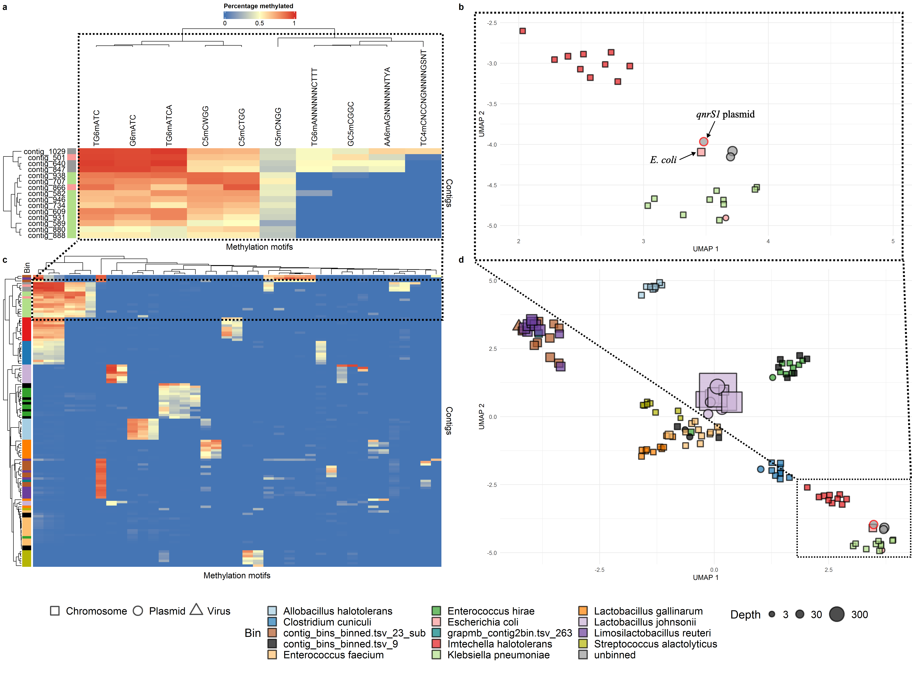

# Readme for FLUPOULmeta pipeline

## Installation
This pipeline consists of a snakemake workflow, and uses mamba/conda to install the correct snakemake version. The best way to get it running is by downloading the GitHub Repository and installing the base snakemake environment: 
```
git clone https://github.com/brambloemen/FLUPOULmeta.git
cd FLUPOULmeta
mamba install workflow/envs/FLUPOUL.yaml

```
### Dependencies
The pipeline also requires quite several tools or tools requiring databases. Some of these tools are managed through mamba/conda environments. These will be installed automatically when running the pipeline with the `--use-conda` snakemake command line parameter set.

Several tools are however not managed through mamba/conda, or are managed with mamba/conda but require downloading of databases (e.g. genomad.). These tools and/or tool databases are specified in a section of the config.yaml file:
```
tools:
  Genomad:
    db: "/data/brbloemen/db/genomad_db"
  MobileOGdb:
    db: "/data/brbloemen/db/mobileOG-db/mobileOG-db_beatrix-1.6.dmnd"
    metadata: "/data/brbloemen/db/mobileOG-db/mobileOG-db-beatrix-1.6-All.csv"
  Seqkit:
    path: "/usr/local/bin/lmod/seqkit/2.3.1/"
  ...
```

If desired, several of the tools can also be replaced with their mamba/conda versions. In that case, the `conda:` directive needs to be added to the respective rules to specify the conda environment to be used for the rule.

### Obtaining the Sequencing Data for the study
The sequencing data for this study were uploaded to the European Nucleotide Archive (ENA), under study accession number PRJEB86979.

The metagenomic sequencing data for this pipeline is stored as .bam files with modified base tags, with the accessions:
ERR14767296 and ERR14767297

## Running the pipeline
The pipeline requires .fastq files with modified base tags as input (instead of the .bam files, e.g. those for the study available on ENA).
Therefore, the .bam files first need to be converted to fastq format with modified base tags:

`samtools fastq -T "*" input.bam > output.fastq`

The -T "*" option ensures the modified base tags are saved in the fastq read headers.
The pipeline can the be run as follows:
```
mamba activate FLUPOUL
snakemake --snakefile {SNAKEFILE_PATH} --configfile {CONFIG_YAML_PATH} --config sample=${sample_name} threads=${THREADS} \
fastq=${FASTQ_PATH} --use-conda
```
By default, the directories for the snakefile and configfile are:
* FLUPOULmeta/workflow/Snakefile
* FLUPOULmeta/config/config.yaml

Outputs are written to FLUPOULmeta/workflow/results, with the sample name parameter determining the prefix of the output.

## Output and visualization
The outputs will be generated under `FLUPOULmeta/workflow/results/sample`. 

* The `Summary` directory in there will contain the main information on AMR genes detected in contigs/reads and their assigned host organism/mobile element (tsv format).
* The methylation data used to generate the plots in the manuscript can be found under `FLUPOULmeta/workflow/results/F4D4_test/NanoMotif/motifs-scored.tsv`
* Scripts for strain haplotyping, read clustering by haplotype, and assembly of those reads can be found under `FLUPOULmeta/workflow/scripts/Floria.sh` and `FLUPOULmeta/workflow/scripts/StrainAssemb_Floria.sh`

